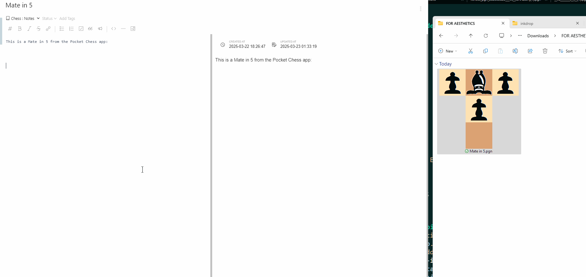

## Chess Rabbit

Chess Rabbit allows you to drag-and-drop PGN files directly into Inkdrop, and creates a Lichess paste from them, so that you can analyze games, puzzles, or whatever it is you do with chess.

Thanks to @k-yagi for the inkdrop-dnd-paste-image plugin for inspiration:

https://github.com/k-yagi/inkdrop-dnd-paste-image

### TODO

-   [x] Get a PGN file to drag and drop and paste to Lichess.
-   [x] Link to the Lichess game page.
-   [x] Show off the file or contents.
-   [x] Show a Gif of the PGN.
-   [ ] Allow use of your own API key.

### Using your own API key

For the fancy people. Also, THIS DOES NOT WORK YET.

Visit this link to generate an API token with the necessary permissions:

https://lichess.org/account/oauth/token/create?scopes[]=preference:read&scopes[]=preference:write&scopes[]=email:read&scopes[]=engine:read&scopes[]=engine:write&scopes[]=challenge:read&scopes[]=challenge:write&scopes[]=challenge:bulk&scopes[]=study:read&scopes[]=study:write&scopes[]=tournament:write&scopes[]=racer:write&scopes[]=puzzle:read&scopes[]=team:read&scopes[]=team:write&scopes[]=team:lead&scopes[]=follow:read&scopes[]=follow:write&scopes[]=msg:write&scopes[]=board:play&scopes[]=bot:play&scopes[]=web:mod&description=Inkdrop+Chess+Rabbit
